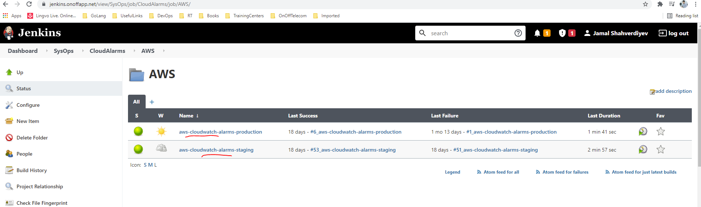

# Usage.
### Prerequisites:

You have the following tools installed on your computer:

- [Git](https://git-scm.com/downloads "Git downloads page") 
- [aws cli](https://docs.aws.amazon.com/cli/latest/userguide/install-cliv2.html "AWS CLI install page")
- [JQ](https://stedolan.github.io/jq/download/ "Tool to parse Json data")

## In order to have a working environment please follow the sequence shown below:
- [x] Prepare environment
- [x] Start script

### Prepare environment
#### Create IAM Policy and user which will use this policy
```bash
$ policy_name='cloudwatch-jenkins-policy'; policy_file_name='jenkins-cw-policy.json'; aws_iam_user_name='cw-jenkins'
$ policy_arn=$(aws iam create-policy --policy-name ${policy_name} --policy-document file://${policy_file_name} | jq -r '.Policy.Arn')
$ aws iam create-user --user-name ${aws_iam_user_name}
$ aws iam attach-user-policy --user-name ${aws_iam_user_name} --policy-arn ${policy_arn}
$ aws_iam_user_object=$(aws iam create-access-key --user-name ${aws_iam_user_name})
$ access_key_id=$(echo ${aws_iam_user_object} | jq -r '.AccessKey.AccessKeyId')
$ secret_access_key=$(echo ${aws_iam_user_object} | jq -r '.AccessKey.SecretAccessKey')
```

#### Clone repository and login to AWS
Use outputs from `access_key_id` and `secret_access_key` variables to get values of `aws configure` command.
```bash
$ aws configure
```

### Start script
 
Execute `check_cloudwatch_alarms.sh ` script with one of the parameters to prepare CSV file template, compare with AWS CloudWatch objects or update it from CSV file to Cloudwatch.
```bash
$ ./check_cloudwatch_alarms.sh 
Usage: 
  ./check_cloudwatch_alarms.sh [-g/--get/, -u/--update/, -c/--check] csv_file_name
   -g/--get    csv_file_name     Saves all alarms to the CSV file
   -u/--update csv_file_name     Applies all changes inside of the CSV file to the AWS Cloudwatch alarms
   -c/--check  csv_file_name     Compare AWS alarms with CSV file and prints the names of the alarms
```
### Code details

- `libs` folder contains functions and variable files which used inside `check_cloudwatch_alarms.sh`, `compare_alarms_db_with_aws.sh`, `prepare_alarms_db.sh` and `update_alarms_from_db.sh` scripts.
- `check_cloudwatch_alarms.sh` main file which needs `--env` parameter with argument to Create/Compare/Update objects. It will calls `compare_alarms_db_with_aws.sh`, `prepare_alarms_db.sh` and `update_alarms_from_db.sh` scripts with argument from `--env` parameter. 
- `prepare_alarms_db.sh` script creates CSV database of the CloudWatch alarms from AWS. 
- `update_alarms_from_db.sh` script updates Cloudwatch alarms settings from predefined CSV file.
- `check_cloudwatch_alarms.sh` script compares local CW alrams database from CSV file with the remote.

[Jenkins](https://jenkins.project.net/view/SysOps/job/CloudAlarms/job/AWS/ "Jenkins CloudWatch Jobs") calls script with the following codes (We can change it with build parameters):
```
cd scripts/cloudwatch_alarms/check_cloudwatch_alarms
export AWS_DEFAULT_REGION=eu-west-1

if [ ${ACTION} = 'Download' ]; then
    git checkout master && git pull 
    git rm ${CSV_FILE} 
    ./check_cloudwatch_alarms.sh --get ${CSV_FILE}
    git add ${CSV_FILE} && git commit -m "Add base CSV template file" && git push origin master
elif [ ${ACTION} = 'Update' ]; then
    ./check_cloudwatch_alarms.sh --update ${CSV_FILE}
else
    ./check_cloudwatch_alarms.sh --check ${CSV_FILE}
fi
```

Staging and Production environment of the [Jenkins](https://jenkins.project.net/view/SysOps/job/CloudAlarms/job/AWS/ "Jenkins CloudWatch Jobs") look like as following:
